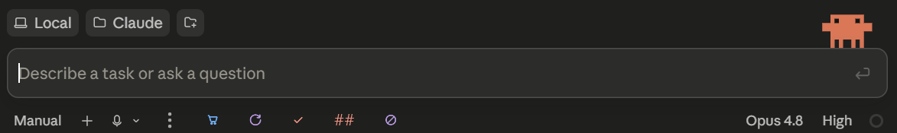
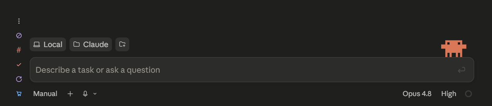
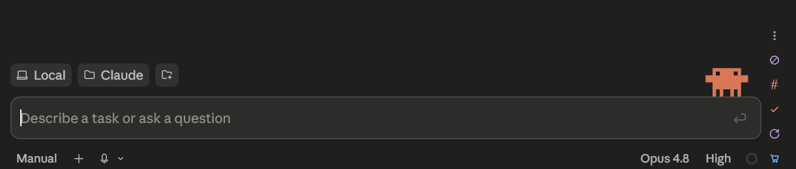

# Claude Buttons

A slim, native-looking button strip that docks onto the **Claude desktop app**'s bottom bar
(Windows) and types slash-commands or text into the chat when you click. Pin your most-used
commands as one-click buttons — globally or scoped to a specific chat, on the bottom row or in a
vertical bar down either side, grouped and colour-coded if you want them that way.

*(Dansk vejledning: se [README.da.md](README.da.md).)*



The same buttons can live in a vertical bar down either margin instead — useful once the row gets
long, and it leaves the control row to the app:





## Why

The Claude desktop app has no way to pin a slash-command as a clickable button. This tool adds
that: a floating strip, styled to match the app's dark theme, that follows the Claude window and
appears only when it's in the foreground.

## Features

- **Pin any command** as a pill button — instantly, from the strip's **⋮ menu** (no round-trip through Claude), or via the `/pin` skill.
- **Global or per-chat** buttons. Per-chat buttons appear only when that chat is on screen (detected from the app's own accessibility tree) and never auto-send — they insert the text so you review it first.
- **Native look**: each strip is a transparent, per-pixel-alpha overlay that sits directly on the bottom bar with no backing box, so the pills read as part of the app's own chrome.
- **Composer-anchored docking**: the strip locks onto the chat's composer in the app's accessibility tree and sits right after the app's own controls (Auto / + / mic). It follows resize, fullscreen, DPI, and **split / stacked / grid panes** — every visible chat gets its own strip.
- **Side bars.** Move buttons to a vertical strip in the left or right pane margin instead of the bottom row, so a long row doesn't have to stay a long row. The ⋮ menu can move there too, and **Move to bar** takes the whole strip with it.
- **Groups.** Collapse several buttons into one face on the bar; hovering opens a flyout with the members. A group carries its own icon and label, and reordering moves the group as a block rather than scattering its members.
- **Per-kind colours.** Prompts, slash commands, groups and toggles can each take a colour, set from ⋮ → Colours. The kind is derived from the button, so a newly pinned slash command picks up the command colour automatically.
- **Button size** from ⋮ → Button size, 14–32 px, applying to the whole panel. Buttons keep their size when the window moves between monitors of different DPI.
- **The button verifies before it sends.** It reads the message box back through the accessibility tree and only presses Enter once it can see that what landed came from the button. If it can't confirm — a paste that didn't arrive, a stale clipboard, text it didn't put there — it sends nothing, leaves the box untouched and tells you. See [CHANGELOG.md](CHANGELOG.md) for what it does and does not catch.
- **Two-click confirm** for destructive buttons (`"confirm": true`).
- **Icon buttons**: give a button an icon instead of text (`"icon": "mic"`) — a small round button the same size as the app's own mic button. Uses Windows' built-in Fluent icon font (Lucide-style line icons, no downloads).
- **Toggle (on/off) buttons** (`"toggle": true`): the button stays lit while active, like the app's mic — optionally sending different text on activate/deactivate (`textOn`/`textOff`).
- **Long standard prompts**: a button's text can be a full multi-paragraph prompt. Long/multiline text is pasted atomically via the clipboard (instant, your previous clipboard is restored). Write and edit prompts in a multiline editor: *Other: type your own...* when pinning, or right-click → *Edit text/prompt...* on any button.
- **English / Danish** UI, switchable in the menu.
- **Resilient**: everything the app exposes (accessibility names, zones) is configurable in `buttons.json`, so an app update degrades gracefully instead of breaking.

## Requirements

- Windows 10 or 11
- The Claude desktop app
- Built-in **Windows PowerShell 5.1** (ships with Windows; do not run under PowerShell 7)
- Claude Code skills/hooks support (for the optional `/pin` and `/unpin` commands)

## Install

```powershell
# 1. Download this repo (git clone avoids the "downloaded file" SmartScreen warning):
git clone https://github.com/IncredibleFyrkat/claude-buttons.git
cd claude-buttons

# 2. Run the installer:
powershell -NoProfile -ExecutionPolicy Bypass -File install.ps1
```

Or double-click **`install.cmd`**.

The installer:
- copies the panel to `%LOCALAPPDATA%\Programs\ClaudeButtons` (kept out of any cloud-synced folder),
- installs the `/pin` and `/unpin` skills into `~/.claude/skills`,
- merges **one** hook (`UserPromptSubmit`) into `~/.claude/settings.json` — backed up first, and only if not already present,
- optionally sets up autostart at logon.

**Restart the Claude app once** after installing so the `/pin` and `/unpin` skills load.

### Optional: shutdown-on-done

The installer offers — **off by default, always asks first, requires Node.js** — the
*shutdown-on-done* engine (contributed by Rasmus): shut the PC down when a chat is COMPLETELY
done with its work. The agent judges "done" (background tasks, subagents and all) and arms the
real shutdown only as the final action of its final wrap-up — so the PC never powers off
mid-task. 60-second grace on every shutdown; `shutdown -a` aborts.

Installing it adds a `/shutdown-on-done on|off|status` command, a completion-judged `Stop` hook,
**eight** permission allow-rules — the four subcommands `request-off`, `on --this-turn`, `off`
and `status`, each in a quoted and an unquoted form, so the agent can disarm and arm the
shutdown while you sleep. `request-on`, which is what *starts* a shutdown request, is
deliberately **not** pre-authorised: it will ask you to approve it, and that approval is the
consent. Installing also adds a stateful
**power toggle button** in the panel: lit exactly while a standing shutdown request exists
(mirrored from `%USERPROFILE%\.claude\shutdown-on-done\*.request` via `stateGlob`), two-click
confirm to arm, one click to cancel. It is never installed silently.

## Usage

- Switch to the Claude app — the strip appears in the bottom bar.
- **Click the ⋮ menu** (the kebab at the left of the strip) → *Pin new button* → pick a command from the *global* or *this chat* submenu (scope is chosen in one click).
- **Left-click** a button to type its command; global buttons also press Enter, per-chat buttons let you review first.
- **Shift-click** to insert the text **without** sending, so you can extend or edit the prompt before pressing Enter yourself. (Only meaningful on buttons that would otherwise send — per-chat buttons never auto-send anyway. Toggles do not flip on a Shift-click: the command is parked, not executed.)
- **Hover a button** for a themed tooltip showing its command, scope and behavior — add your own explanation with a `"desc"` field in `buttons.json`.
- **Right-click a button** → rename, edit the text/prompt, set an icon, switch on/off (toggle) mode, reorder (*Move left / Move right*), or remove.
- The **⋮ menu** also holds **Language** (English / Dansk), a **Hover tooltips** on/off switch, and **Close panel**. The strip docks itself to the composer — there is no manual placement to fiddle with.

### Icons

Right-click a button → *Set icon...* to browse them in a visual picker, or type a name directly.
The 134 built-in names (all from Windows' Segoe Fluent Icons font — no downloads):

- **Core**: `mic, power, play, pause, stop, refresh, check, x, trash, settings, search, save, code, bug, star, pin, send, bell, clock, sun, moon, zap, home, folder, camera, edit, plus, download, upload, user, mail, globe, lock, heart, flag, calendar, phone, broom, terminal, shield, copy, link`
- **Help / status**: `help, question, info, warning, error`
- **Actions / editing**: `sync, filter, list, eye, undo, redo, clipboard, file, keyboard, bulb`
- **Chat / feedback**: `comment, message, thumbup, thumbdown, more`
- **Arrows / navigation**: `arrow-right, arrow-left, arrow-up, arrow-down, up, down, chevron-left, chevron-right, expand, collapse, move, menu, grid`
- **Notes / documents**: `note, document, text, book, archive, tag, attach, checklist, brackets, cut`
- **Media / image**: `image, video, crop, palette, brush, contrast, volume, mute, headphones, record`
- **People / social**: `people, contacts, badge, smile, chat, share, megaphone, gift, cart`
- **Devices**: `monitor, laptop, mobile, mouse, devices, wifi, bluetooth, cloud, print, game, car, plane, building`
- **Misc**: `sparkle, target, sliders, zoom-in, zoom-out, unlock, block, reset, logout, alarm, bell-off, star-fill, location, translate, accessibility, education, click`

You can also give any 4-digit hex codepoint from the Segoe Fluent Icons font. Icon buttons show
their label and command in the tooltip.

### Toggle buttons

Right-click a button → *On/off (toggle) mode*. The button now lights up while active. In
`buttons.json` you can give it different texts for each direction:

```json
{ "label": "Focus", "icon": "zap", "text": "enter focus mode", "textOff": "exit focus mode",
  "toggle": true, "submit": true }
```

`textOn` (defaults to `text`) is typed when switching on, `textOff` when switching off (omit it
to make switching off silent).

**Truthful state via the filesystem** (`stateGlob`): instead of remembering its own on/off state,
a toggle button can mirror reality — it is lit if and only if a file matching a glob exists:

```json
{ "label": "Shutdown on done", "icon": "power", "toggle": true, "confirm": true,
  "stateGlob": "%USERPROFILE%\\.claude\\shutdown-on-done\\*.request",
  "text": "arm shutdown-on-done", "textOff": "cancel shutdown-on-done", "submit": true }
```

The panel polls the glob about once a second, so if an agent, hook or another surface changes the
state behind your back, the button follows within a second. Clicking still flips optimistically
for instant feedback and is corrected if reality disagrees.

**Confirm is asymmetric for toggles**: `confirm: true` gates switching **on** (two clicks) but
never switching **off** — disarming a dangerous state should always be one click.

## What you're running (honesty section)

This is unsigned PowerShell + a small `.vbs` launcher. That's normal for a hobby tool, but you
should know what it does before trusting it:

- `claude-buttons.ps1` — the panel. It reads the Claude window's position and accessibility tree, draws a strip, and sends keystrokes to the Claude window when you click a button. It does **not** make network connections.
- `Launch.vbs` — starts the panel with no console window (`powershell.exe -ExecutionPolicy Bypass` affects **only that one launch**, not your system policy).
- The `UserPromptSubmit` hook writes the current chat's session id to `~/.claude/active-session.json` so the panel knows which chat is on screen. Nothing else.

Read the source — it's a single, commented file. If Windows SmartScreen warns about the downloaded
scripts, that's the standard "unknown publisher" notice for unsigned scripts; `git clone` avoids it.

## Config reference (`buttons.json`)

The file the panel reads (created from `buttons.default.json` on first install, in
`%LOCALAPPDATA%\Programs\ClaudeButtons`). Top-level fields:

| Field | Default | Meaning |
|---|---|---|
| `schemaVersion` | `1` | Config format version. |
| `buttons` | `[]` | The button list (see below). |
| `targetTitle` | `"Claude"` | Substring the target window's title must contain. |
| `targetProcess` | `"claude"` | Process name that must own the window. |
| `uiaPaneMatch` | `" pane$"` | Regex; every Group whose accessibility name matches is treated as a chat pane (matches `Primary pane`, `Secondary pane`…). |
| `uiaComposerName` | `"Prompt"` | Accessibility name of the chat composer the strip docks to. **This is the knob to try first if a Claude update breaks the strip** — docking matches this name. |
| `zoneTop` / `zoneBottom` | `45` / `55` | Logical-px zones where the chat title tab / bottom button row live. |
| `fallbackRow` | `33` | Strip center above the window bottom when the button row can't be measured. |
| `stripGap` | `10` | Gap (px) between the app's own buttons and the strip. |
| `reservedW` | `380` | Width reserved for the app's own bar elements (compact-mode threshold). |
| `relX` | `0.0` | Horizontal position within the pane (0–1). |
| `vNudge` | `0` | Vertical nudge in px (+ down, − up). Use this when the strip sits a few px off after an app update. |
| `tipsOff` | `false` | Hover tooltips off. Set from the ⋮ menu and written back here, so you may see it appear in your file. |
| `lang` | `"en"` | UI language: `en` or `da`. |
| `groups` | `{}` | Group definitions, keyed by group name: `{ "ops": { "icon": "settings", "label": "Ops" } }`. A group appears once a button carries its name in `group`, and its definition is dropped automatically when the last member leaves. **Keys are matched case-insensitively** — a group name is a JSON key, and PowerShell's JSON reader refuses a file containing keys that differ only in case, so `Ops` and `ops` are folded into one rather than allowed to become a file the panel cannot read. |
| `colors` | `{}` | Per-kind button colour, keyed by kind: `prompt`, `command`, `group`, `toggle`. Set from the ⋮ menu. Kind is derived from the button, not stored, so a newly pinned slash command picks up the command colour. |
| `kebabBar` | `"row"` | Which strip the ⋮ menu handle sits on: `row`, `left` or `right`. |
| `btnSize` | `21` | Button size in logical px, 10–40, for the whole panel. Set from ⋮ → **Button size**; scales with the monitor like everything else. |
| `sideNudge` | `0` | Moves a **right-hand** side bar further out from the chat, in logical px. Needed because the chat's visual edge is not exposed in the accessibility tree — every anchor that can be measured (the composer, the control row, the pane) sits somewhere *inside* the rounded container, so the last few pixels cannot be derived. The left bar needs no correction and is unaffected. |
| `sideNudgeY` | `0` | Same, vertically: negative lifts a right-hand bar, positive lowers it. |

Per-button fields:

| Field | Meaning |
|---|---|
| `label` | Display text. |
| `short` | Short label shown in compact mode (~8 chars). |
| `text` | Text typed into the chat on click (may be a long multi-line prompt). |
| `submit` | `true` = press Enter after typing (**global buttons only**; per-chat never auto-send). |
| `confirm` | `true` = two-click "Confirm?" before firing (gates ON only for toggles). |
| `icon` | Icon name (see list above) or a raw 4-hex codepoint; renders a round icon button. |
| `toggle` | `true` = on/off button (lit while on). |
| `textOn` / `textOff` | Text sent when switching on / off (`textOn` defaults to `text`; omit `textOff` for silent off). |
| `stateGlob` | Glob (env vars expanded); the toggle is lit iff a matching file exists — truthful state from the filesystem. |
| `chat` | Session id this button is scoped to (per-chat). |
| `chatTitle` | The displayed chat title this button binds to (preferred per-chat match). |
| `chatLabel` | Human description shown in the tooltip for a per-chat button. |
| `desc` | Extra explanation shown at the top of the hover tooltip. |
| `bar` | Which strip the button lives on: `row` (default, the bottom row), `left` or `right` (a vertical strip in the pane margin). |
| `group` | Name of the group this button belongs to. Grouped buttons collapse into one face on the bar and appear in its hover flyout. Matched case-insensitively — see below. |

## Troubleshooting

- **Strip sits slightly off, or vanishes, after a Claude app update** → the app's UI names/layout changed. Check `%LOCALAPPDATA%\claude-buttons.log`, then adjust the app-dependent values in `buttons.json`. **Start with `uiaComposerName`** (default `"Prompt"`): the strip docks by matching the composer's accessibility name, so a rename there is the most likely breakage and hides every strip. Then `uiaPaneMatch` (split/grid panes), then the geometry values `zoneTop`, `zoneBottom`, `fallbackRow`, `stripGap`, `vNudge`, `reservedW`. Asking Claude to "probe the app's UIA tree and update these" is the quickest fix.
- **App not in English?** Accessibility names like `Prompt` and `… pane` may be localized — set `uiaComposerName` and `uiaPaneMatch` to the localized names in `buttons.json`.
- **`/pin` says unknown command, or does nothing** → restart the Claude app once so the skill loads; the skill writes to the file named in `%USERPROFILE%\.claude\claude-buttons-path.txt`.
- **Nothing appears** → the strip only shows when the Claude window is the foreground window.
- **Keyboard / screen-reader users:** the strip is a mouse-driven overlay that never takes focus. Use the `/pin` and `/unpin` skills (and hand-editing `buttons.json`) as the keyboard/AT path.

## Accessibility

The strip is a mouse-driven overlay that intentionally never takes keyboard focus (so your
keystrokes always go to Claude). That has real limits, stated honestly:

- **Screen readers**: buttons expose an accessible role and name (label + scope + on/off state);
  the ⋮ menu button announces as "Claude Buttons menu".
- **Non-color cues**: per-chat buttons have a brightened border and toggle-on buttons show a filled
  dot — so scope and on/off aren't conveyed by color alone.
- **Text contrast**: a resting button has no background of its own, so its label sits on the
  app's bar at ~11.2:1 (AAA). A lit toggle draws its label in white on the active fill at
  ~5.1:1 (AA); the active fill separates from the bar at ~3.3:1 and the filled state dot from
  the fill at ~3.2:1 (both 1.4.11). **The three toggle figures are asserted by
  `tests\panel.tests.ps1`** and cannot drift away from the code; the resting figure is not.
- **Keyboard-only / AT users**: the strip itself is not keyboard-operable. Use the `/pin` and
  `/unpin` skills (and hand-editing `buttons.json`) as the equivalent path.
- **Target size**: buttons are 27×27 logical px (DPI-scaled), which meets WCAG 2.2 SC 2.5.8
  (24×24, AA). SC 2.5.5 (44×44, AAA) is not met — the strip deliberately matches the scale of
  the app's own bottom-bar controls.

## Development & tests

```powershell
powershell -NoProfile -ExecutionPolicy Bypass -File tests\run-all.ps1
```

Runs the engine tests (`node --test`, covering the shutdown logic against a throwaway
`USERPROFILE` — nothing shuts down), the panel config-lifecycle tests (crafted `buttons.json`
through `-SmokeTest`), and static parse checks. CI runs the same suite on `windows-latest` via
GitHub Actions. There is no automated coverage of the live click/UIA/rendering paths (they need a
real Claude window); `-SmokeTest` covers parse + normalize + control build.

## Uninstall

```powershell
powershell -NoProfile -ExecutionPolicy Bypass -File install.ps1 -Uninstall
```

Removes the skills, the hooks (only the ones this tool added), and the autostart shortcut, and
asks before deleting the program folder and your `buttons.json`.

## License

MIT — see [LICENSE](LICENSE).
